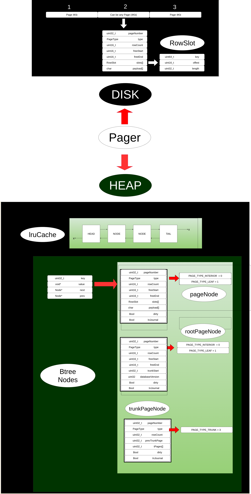

# Custom DBMS (B+ Tree, Pager, LRU, MemPoolManager)

A lightweight key–value store in C++ using a single-file slotted storage format, a B+ tree index, LRU page cache, pager with dirty tracking, defragmentation, rollback journal system with automatic recovery, memory pool management, and a REPL for insert/delete/search operations with transaction support.


## Contents

1. [Overview](#overview)
2. [Storage, Indexing, and On-Disk Format](#storage-indexing-and-on-disk-format)
3. [Transaction Support and Journal System](#transaction-support-and-journal-system)
4. [Supported Operations (REPL)](#supported-operations-repl)
5. [Time Complexity](#time-complexity)
6. [Constants](#constants)
7. [Maximum Values and Limits](#maximum-values-and-limits)
8. [Getting Started](#getting-started)
9. [Repository Layout](#repository-layout)
10. [Notes](#notes)


---


## Storage, Indexing, and On-Disk Format

- **Pages**: Fixed size 4096 bytes (`PAGE_SIZE`).
- **Payload**: Variable-sized record bytes stored compactly between `freeStart` and `freeEnd`.
- **Payload growth direction**: Payload grows backward (from high addresses down toward `freeEnd`).
  - **Reason**: Keeps the slot array at the beginning fixed in place while allowing variable-length records to be appended/removed from the top end, minimizing memmoves. Defragmentation can compact payloads top-down without touching the slot region.
- **Root Page**: Page 1 is always the root. Its payload also stores `trunkStart` for the free-list.
- **Interior Nodes**: Slots hold separator keys; payload stores child page numbers. Convention:
  - For index `i`, `slots[i].offset` points to the left child of key `i`.
  - The rightmost child is stored at `freeStart`.
- **Leaf Nodes**: Slots hold keys; payload holds the corresponding value bytes.
- **Free List (Trunk Pages)**: When pages are freed (after merges), they are recorded into a trunk page chain starting at `trunkStart`. Allocation first consumes from this list; if empty, it allocates new pages, increasing file size.
- **Endianness**: Always written/read on disk as little-endian. Runtime converts as needed.
  - On write: `Pager::writePage` converts host-endian to little-endian with `swapEndian(...)` when necessary.
  - On read: `Pager::getPage`/`getRootPage`/`getTrunkPage` convert from little-endian to host using `swapEndian(...)`.


---


## Transaction Support and Rollback Journal System

The DBMS implements a **rollback journal** system with automatic recovery capabilities for transaction safety and crash recovery. This is different from WAL (Write-Ahead Logging) - it stores the **original** page content before modification, allowing rollback to the pre-transaction state.


### **Journal File Format**

The journal file (`f1-jn.db`) uses a sector-aligned (512-byte) format for optimal disk I/O:

```
[Rollback Header] (sector-aligned)
[Page 1 + Checksum] (sector-aligned)
[Page 2 + Checksum] (sector-aligned)
...
[Commit Marker] (8 bytes: MAGIC_NUMBER)
```

**Rollback Header Structure:**
```cpp
struct rollback_header {
    uint64_t magicNumber;    // 8 bytes - To detect corrupted transaction
    uint32_t numOfPages;     // 4 bytes - Number of pages before a transaction
    uint32_t salt1;          // 4 bytes - Database versioning
    uint32_t salt2;          // 4 bytes - Checksum salt 
}
```


### **Technical Details**


>**Why `fsync()`?**
>- **Durability Guarantee**: `fsync()` forces OS to flush buffered kernel data to disk
>- **Crash Safety**: Without `fsync()`, data might be lost in OS buffers during crash
>- **ACID Compliance**: Ensures "D" (Durability) property of transactions
>
>**Why Checksums?**
>- **Data Integrity**: Detects corruption during disk I/O or memory errors
>- **Rollback Safety**: Ensures journal pages are valid before restoring
>- **Silent Corruption Prevention**: Catches hardware/software errors that could corrupt data
>- **CRC32 Algorithm**: Fast, reliable error detection with low collision probability
>
>**Why Salt Values?**
>- **`salt1`**: Database versioning - allows schema evolution without breaking existing journals
>- **`salt2`**: Random checksum salt - prevents predictable checksum attacks
>- **Checksum Uniqueness**: `crc32_with_salt(page, PAGE_SIZE, salt2)` creates unique checksums

### **Transaction Modes**

- **Auto-Commit Mode** (`COMMIT_NOW = true`): Each operation immediately commits
- **Transaction Mode** (`COMMIT_NOW = false`): Operations are batched until `.c`


### **ACID Properties**

- **Atomicity**: All-or-nothing transaction semantics via journal rollback
- **Consistency**: Checksum validation ensures data integrity
- **Isolation**: Single-threaded operations (no concurrency)
- **Durability**: `fsync()` ensures data is written to disk

### **Example Transaction Usage**

```bash
# Start transaction
.bt
i 100 data1
i 101 data2
i 102 data3
s*                    # View changes (not yet committed)
.c                    # Commit transaction
s*                    # Changes now permanent

# Auto-commit mode (default)
i 200 data4           # Immediately committed
```

---

## Supported Operations (REPL)

- **Insert**: `i <key> <value>`
  - Inserts a new key/value into the B+ tree. If the key already exists, the insert is ignored (no update performed currently).

- **Delete**: `d <key>`
  - Removes the key if present. Triggers underflow handling: borrow from siblings or merge. May free pages into the trunk free-list. Defragmentation is done each time during removing a row. 

- **Select (tree print)**: `s*`
  - Prints a level-order representation of the B+ tree: for interior nodes shows child page numbers and separator keys; for leaves shows leaf keys.

- **Select (inspect page)**: `s <page_no>`
  - Prints a single page node (primarily for debugging). The argument is a page number, not a row key.

- **Transaction Commands**:
  - **`.bt`** - Begin Transaction: Starts a transaction, disabling auto-commit
  - **`.c`** - Commit Transaction: Commits all pending changes and returns to auto-commit mode

- **Print Dirty pages**: `.plru`
  - Prints dirty pages in order of last recently used.

- **Close database**: `.exit`
  - Closes database connections, and exits the application. (also manually allowed)


---


## Time Complexity

- **Search/Insert/Delete**: O(f x lnf x log<sub>f</sub> N), where f is the fan-out (branching factor). With `MAX_ROWS = 4`, f is small for testing; in general, B+ trees scale with page capacity, so f is large and depth is small.
- **Print tree** (`s*`): O(number of pages) for traversal.


---


## Constants

- `PAGE_SIZE = 4096`
- `ROW_SLOT_SIZE = 14`
- `PAGE_HEADER_SIZE = 14` 
- `FREE_START_DEFAULT = 4096`
- `FREE_START_DEFAULT_ROOT = 4092`
- `FREE_END_DEFAULT = PAGE_HEADER_SIZE + ROW_SLOT_SIZE * MAX_ROWS` 
- `NO_OF_TPAGES (trunk) = 2040` 
- `SECTOR_SIZE = 512`


---


> **Why sector-aligned?**  
> Disk I/O is performed in units of sectors (usually 512 bytes). When writing to disk, either an entire sector (512 bytes) is written from disk buffers to the physical medium, or nothing is written at all. This ensures atomic writes and prevents partial or corrupted sectors.
>
> **Page size and the OS kernel:**  
> Operating systems manage memory in fixed-size blocks called "pages" (commonly 4096 bytes on modern systems). Setting the database page size equal to the OS's virtual memory page size allows for more efficient memory mapping and I/O: the database can map file pages directly to memory pages, reducing overhead and improving performance.
>
> **Why use a mempool for LRU in-memory pages?**  
> A mempool groups all in-memory pages in contiguous memory, maximizing **spatial locality** (related data is close together) and **temporal locality** (recently-used pages stay active in the cache). This structure makes LRU operations and page access much faster: lookups, updates, and eviction are efficient due to the predictable memory layout, which also improves CPU cache performance.


## Maximum Values and Limits

- **Key (`key`)**:  
  - Type: `uint64_t`, so the maximum value of id/key is `2^64 - 1 = 18,446,744,073,709,551,615`.

- **Payload (row value)**:  
  - Maximum payload per row is determined by page layout:
    - For a **leaf page**:  
      - `MAX_PAYLOAD_SIZE = PAGE_SIZE - PAGE_HEADER_SIZE - sizeof(RowSlot) * MAX_ROWS`
      - With `PAGE_SIZE = 4096`, `PAGE_HEADER_SIZE = 14`, `MAX_ROWS = 4`, `sizeof(RowSlot) = 14`:
        - `MAX_PAYLOAD_SIZE = 4096 - 14 - (14*4) = 4096 - 14 - 56 = 4026` bytes per page for all payloads.
      - **Maximum payload per row**:  
        - If only one row: up to ~4026 bytes (minus slot and header), but with `MAX_ROWS = 4`, practical per-row payload is smaller.
        - This means **roughly ~1000 characters can be stored for each id when `MAX_ROWS=4`**.
        - If `MAX_ROWS=100`, then each row can store **roughly ~40 characters** (since 4026/100 ≈ 40).
        - The actual per-row payload is limited by available space at insert time and the number of rows per page.
         
    - For the **root page**:  
      - `MAX_PAYLOAD_SIZE_ROOT = MAX_PAYLOAD_SIZE - sizeof(uint32_t)` (to reserve space for `trunkStart`).
      - So, `MAX_PAYLOAD_SIZE_ROOT = 4026 - 4 = 4022` bytes.

- **Number of pages / Disk size**:
  - **Page number**:  
    - Type: `uint32_t`, so maximum page number is `2^32 - 1 = 4,294,967,295`.
  - **Maximum database file size**:  
    - `MAX_PAGES = 2^32 - 1`
    - `MAX_DB_SIZE = MAX_PAGES * PAGE_SIZE = (2^32 - 1) * 4096 ≈ 17.59 TB`
    - In practice, the file size is limited by the OS and filesystem, but the code supports up to ~4.29 billion pages.


---


**Note:**  
Throughout the codebase, the minimal possible size for each variable is used to optimize memory and disk usage. For example, `uint16_t` is used for row counts and offsets because `MAX_ROWS` can be stored in it.


---


## Getting Started

- **Prerequisites**: g++ (C++17), Little-Endian host machine, `zlib` development libraries (for `crc32` checksums)

- **Build**
  - From the project root:

    ```cpp
    rm -f f1.db && rm -f f1-jn.db && g++ -std=gnu++17 -O2 -o dbms main.cpp -lz
    ./dbms
    ```

    Reason for using `-O2`: The code relies on a tightly packed memory layout for pages and records, enforced via `__attribute__((packed))` in struct definitions. This is crucial for correct on-disk and in-memory page structure. The `-O2` optimization flag helps ensure the compiler does not introduce unexpected padding or reordering, keeping the layout compact and predictable. 
    An appropriate approach for production systems would be **not** to use C++ structs for on-disk page layout,
    but instead to define a format like:
    
    ```cpp
            struct {
                uint8_t memPage[4096];
            };
    ```
    
    and then manually encode/decode fields at specific offsets. This avoids any reliance on `__attribute__((packed))` and does not depend on compiler struct layout or optimization flags. However, the main objective of this project
    was to keep the code as simple as possible, implementing only the essentials to understand the workflow and the intricacies of structs and compilers. The current code uses packed structs for clarity and brevity, but a real-world DBMS would use explicit byte layouts for full portability and safety.
    
    Note: This approach is compiler-specific and may not work as intended on compilers that do not honor `__attribute__((packed))` or have different struct layout rules.

- **Fuzz Testing using AI**
  - Sample input files for basic operations are provided under `ai fuzz testing/`.
  - Sample input files specifically for transactions are included in `ai_fuzz_testing_transactions/`.


---


## Repository Layout

- `main.cpp`: REPL, Journal handling, db open/close
- `btree.h`: B+ tree implementation (insert, delete, search, split/merge, print)
- `pager.h`: Page I/O, cache integration, endian conversion, flush
- `LRU.h`: LRU cache
- `MemPoolManager.h`, `MemPoolManager.cpp`: Custom memory pool for efficient fixed-size object allocation.
- `structs.h`: All on-disk and in-memory page/record structs and constants
- `utils.h`, `enums.h`, `headerfiles.h`: shared helpers, enums, and includes


---


## Notes

- Insertion does not currently update existing keys.
- Endianness behavior is implemented, but not yet thoroughly tested on big-endian hosts.
- No concurrency support yet.
- Only works on machine based on 2's complement arithmatics :)


## Struct Layout 
<div align="center">

</div>

