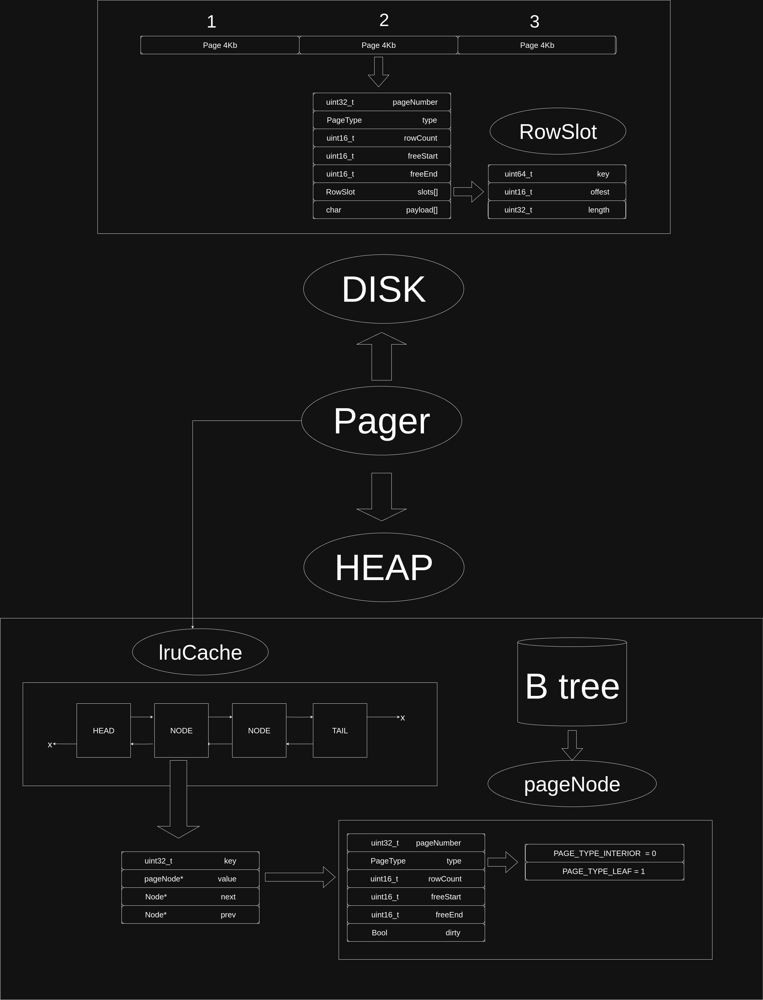

Custom DBMS with B+ Tree, Slotted Pages, and LRU Pager

Overview

This project is a minimal database engine in C++ implementing:
- B+ tree index over fixed-size pages
- Slotted-page layout for records (key + variable-length payload)
- Pager layer with LRU cache and write-back flushing
- Simple REPL supporting insert and select commands

Key Components

- enums.h: Core enums for statement parsing, execution results, and page types.
- headerfiles.h: Common includes and constants:
  - PAGE_SIZE = 4096, PAGE_HEADER_SIZE = 14, MAX_ROWS = 4
  - Slotted-page metadata: `RowSlot`, `pageNode`, payload sizing
- pages_schema.h: On-disk page layout (`Page`) and row schema for parsing/serializing.
- LRU.h: Intrusive LRU cache for page frames with O(1) get/put.
- pager.h: Pager that maps page numbers to frames via LRU, performs read/write, flushAll.
- btree.h: B+ tree (insert, split leaf/internal, new root creation, breadth-first print).
- utils.h: Lower/upper bound helpers over `RowSlot[]` for ordered key operations.
- main.cpp: REPL + wiring of Pager and B+ tree; handles `.exit`, `insert`, `select`.


Runtime Page Frame (pageNode)

- Mirrors on-disk `Page` with `dirty` bit for write-back
- Managed by `LRUCache` via the `Pager`

B+ Tree

- Search descends using upper bound on interior nodes
- Insert finds leaf, inserts or splits leaf; may cascade splits up to root
- Root split promotes new interior root at page 1; pages numbered incrementally
- `printTree()` prints the tree level by level

Pager and LRU

- `Pager::getPage(n)`: fetch from LRU or read from file, materialize to `pageNode`
- `Pager::writePage(node)`: write a frame back
- `Pager::flushAll()`: write back all dirty frames in LRU on shutdown

REPL Commands

- insert <key:uint64> <payload:string>
  - Inserts a row. If key exists, current code silently ignores update.
- select
  - Prints the B+ tree (level-order) with keys and child page numbers
- .exit
  - Flushes and exits


Example build command:

```bash
g++ -std=gnu++17 -O2 -Wall -Wextra -o db main.cpp
```

Run

```bash
./db
```

By default, the program opens/creates `f1.db` with LRU capacity 256.

Usage Examples

```text
db >insert 1 alice
 :success
db >insert 2 bob
 :success
db >select
[ leafkey: 1 leafkey: 2 ]
 :success
db >.exit
```

Notes and Limitations

- MAX_ROWS is 4 for testing; adjust in `headerfiles.h`
- No deletion, no update (modify is parsed but unused), no recovery/transactions
- Interior node payload stores child page numbers; access via `Pager::getPageNoPayload`
- Page 1 is reserved for current root; page numbers auto-increment on allocations

File Overview Diagram (logical)




